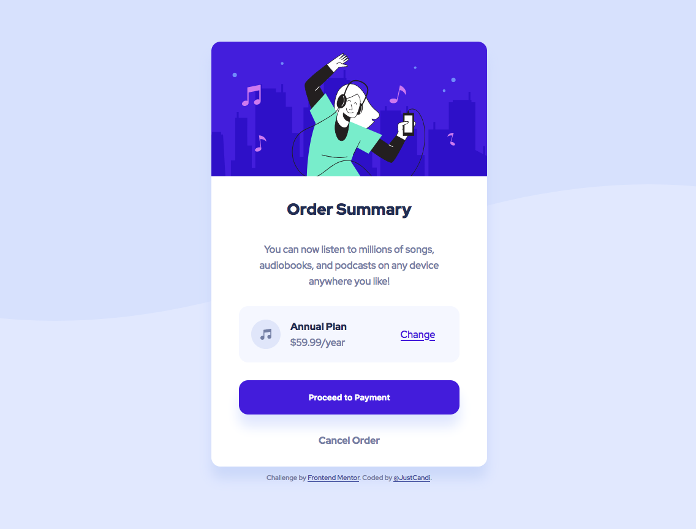

# Frontend Mentor - Order summary card

Hi 👋, This is my solution to the [Order summary card challenge on Frontend Mentor](https://www.frontendmentor.io/challenges/order-summary-component-QlPmajDUj). Frontend Mentor challenges help you improve your coding skills by building realistic projects. 

## Table of contents

- [Overview](#overview)
  - [The challenge](#the-challenge)
  - [Screenshot](#screenshot)
  - [Links](#links)
- [My Process](#my-process)
  - [Built with](#built-with)
- [Author](#author)

## Overview

### The challenge

Users should be able to:

- See hover states for interactive elements

### Screenshot

### Links

- Solution URL: [Frontend Mentor Solution page](https://www.frontendmentor.io/solutions/order-summary-component-using-flexbox-sOUO8tGWjY)
- Live Site URL: [Github Pages](https://justcandi.github.io/Order-Summary-Flexbox/)

## My process

### Built with

- Semantic HTML5 markup
- CSS custom properties
- Flexbox
- Grid

## Author

- Frontend Mentor - [@candiuk](https://www.frontendmentor.io/profile/candiuk)
